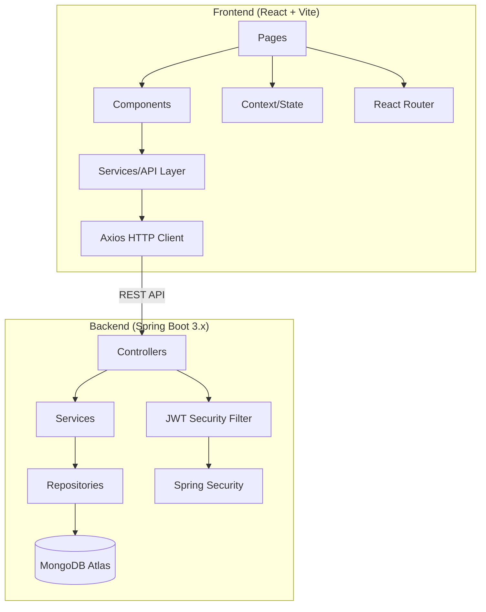

# JobFusion – Unified Job Discovery & Tracking Platform

A modern full-stack job aggregation website with React.js frontend, Java Spring Boot backend, and MongoDB Atlas database.

## Proposed Architecture



## User Review Required

> [!IMPORTANT]
> **Java/Maven Required**: The backend requires Java 17+ and Maven installed on your system. Please confirm you have these installed, or if you'd prefer a Node.js/Express backend alternative.

> [!IMPORTANT]
> **MongoDB Atlas**: You'll need a MongoDB Atlas connection string. The app will use environment variables for this. A local MongoDB fallback will also work.

> [!WARNING]
> **Scope Management**: This is a very large project. I'll build it in phases, starting with a fully functional frontend with mock data, then the complete backend, then integration. This ensures you have a working UI at every stage.

## Open Questions

1. **Do you have Java 17+ and Maven installed?** If not, I can provide installation steps or switch to a Node.js backend.
2. **Do you have a MongoDB Atlas connection string ready?** If not, I'll configure the backend to work with a local MongoDB instance with easy Atlas migration.
3. **Authentication priority**: Should I implement full OAuth (Google/GitHub login) or just email/password JWT auth for the initial version?

---

## Proposed Changes

### Phase 1: Frontend Foundation

#### Project Setup
- Initialize React project with Vite
- Configure Tailwind CSS v4 with custom theme
- Install dependencies: `framer-motion`, `recharts`, `axios`, `react-router-dom`, `react-hot-toast`, `lucide-react`, `@heroicons/react`
- Set up folder structure, routing, theme context (dark/light mode)

#### [NEW] Frontend Project Structure
```
frontend/
├── index.html
├── vite.config.js
├── package.json
├── .env.example
├── src/
│   ├── main.jsx
│   ├── App.jsx
│   ├── index.css                    # Tailwind + global styles + glassmorphism
│   ├── context/
│   │   ├── ThemeContext.jsx          # Dark/Light mode
│   │   ├── AuthContext.jsx           # JWT auth state
│   │   └── JobContext.jsx            # Job search state
│   ├── hooks/
│   │   ├── useAuth.js
│   │   ├── useJobs.js
│   │   ├── useDebounce.js
│   │   └── useLocalStorage.js
│   ├── services/
│   │   ├── api.js                    # Axios instance + interceptors
│   │   ├── authService.js
│   │   ├── jobService.js
│   │   ├── profileService.js
│   │   └── mockData.js              # Realistic sample job data
│   ├── layouts/
│   │   ├── MainLayout.jsx           # Public layout (navbar + footer)
│   │   ├── DashboardLayout.jsx      # Sidebar + top nav
│   │   └── AuthLayout.jsx           # Auth pages layout
│   ├── components/
│   │   ├── common/
│   │   │   ├── Navbar.jsx
│   │   │   ├── Footer.jsx
│   │   │   ├── Sidebar.jsx
│   │   │   ├── SearchBar.jsx
│   │   │   ├── LoadingSkeleton.jsx
│   │   │   ├── ProtectedRoute.jsx
│   │   │   ├── ThemeToggle.jsx
│   │   │   ├── NotificationPanel.jsx
│   │   │   └── Toast.jsx
│   │   ├── home/
│   │   │   ├── HeroSection.jsx
│   │   │   ├── TrendingTech.jsx
│   │   │   ├── FeaturedCompanies.jsx
│   │   │   ├── RemoteJobs.jsx
│   │   │   ├── FresherJobs.jsx
│   │   │   ├── StatsSection.jsx
│   │   │   └── CTASection.jsx
│   │   ├── jobs/
│   │   │   ├── JobCard.jsx
│   │   │   ├── JobFilters.jsx
│   │   │   ├── JobList.jsx
│   │   │   ├── Pagination.jsx
│   │   │   └── SearchSuggestions.jsx
│   │   ├── dashboard/
│   │   │   ├── SavedJobs.jsx
│   │   │   ├── AppliedJobs.jsx
│   │   │   ├── ProfileCompletion.jsx
│   │   │   ├── Recommendations.jsx
│   │   │   ├── AnalyticsCharts.jsx
│   │   │   └── RecentlyViewed.jsx
│   │   └── profile/
│   │       ├── ResumeUpload.jsx
│   │       ├── SkillsSection.jsx
│   │       ├── EducationSection.jsx
│   │       ├── ExperienceSection.jsx
│   │       └── PortfolioLinks.jsx
│   ├── pages/
│   │   ├── HomePage.jsx
│   │   ├── JobSearchPage.jsx
│   │   ├── LoginPage.jsx
│   │   ├── SignupPage.jsx
│   │   ├── ForgotPasswordPage.jsx
│   │   ├── DashboardPage.jsx
│   │   ├── ProfilePage.jsx
│   │   └── NotFoundPage.jsx
│   └── utils/
│       ├── constants.js
│       ├── helpers.js
│       └── validators.js
```

---

### Phase 2: Frontend Pages & Components

#### [NEW] Home Page (`HomePage.jsx`)
- Animated hero section with floating search bar and gradient background
- "Trending Technologies" horizontal scroll cards (React, Python, AI/ML, etc.)
- Featured companies grid with logos (Google, Microsoft, Amazon, etc.)
- Remote jobs carousel section
- Fresher jobs section with filters
- Animated counter stats (10K+ Jobs, 500+ Companies, etc.)
- CTA section with glassmorphism cards

#### [NEW] Job Search Page (`JobSearchPage.jsx`)
- Sticky search bar with auto-suggestions dropdown
- Filter sidebar: remote/on-site, salary range slider, experience level, skills chips, company type
- Job cards grid: company logo, title, salary, location, experience, source platform badge, save/apply buttons
- Loading skeletons while fetching
- Pagination component
- "No results" state with illustration

#### [NEW] Auth Pages (`LoginPage.jsx`, `SignupPage.jsx`, `ForgotPasswordPage.jsx`)
- Split-screen design with illustration + form
- Form validation with real-time feedback
- JWT token storage and auto-redirect
- Social login buttons (UI only initially)
- Password strength indicator

#### [NEW] Dashboard Page (`DashboardPage.jsx`)
- Sidebar navigation with collapsible menu
- Stats overview cards (Applications, Saved, Views, Matches)
- Application tracking table with status badges
- Saved jobs grid
- Recharts analytics (applications over time, job match score)
- Job recommendations carousel
- Recently viewed jobs list
- Profile completion progress ring

#### [NEW] Profile Page (`ProfilePage.jsx`)
- Profile header with avatar and edit capability
- Resume upload with drag-and-drop
- Skills section with tag input
- Education timeline
- Experience timeline
- Portfolio links (GitHub, LinkedIn, personal site)
- Profile completeness meter

---

### Phase 3: Backend (Spring Boot)

#### [NEW] Backend Project Structure
```
backend/
├── pom.xml
├── src/main/java/com/jobfusion/
│   ├── JobFusionApplication.java
│   ├── config/
│   │   ├── SecurityConfig.java
│   │   ├── CorsConfig.java
│   │   ├── MongoConfig.java
│   │   └── WebConfig.java
│   ├── security/
│   │   ├── JwtTokenProvider.java
│   │   ├── JwtAuthFilter.java
│   │   ├── JwtAuthEntryPoint.java
│   │   └── CustomUserDetailsService.java
│   ├── controller/
│   │   ├── AuthController.java
│   │   ├── JobController.java
│   │   ├── UserController.java
│   │   ├── SavedJobController.java
│   │   ├── ApplicationController.java
│   │   └── RecommendationController.java
│   ├── service/
│   │   ├── AuthService.java
│   │   ├── JobService.java
│   │   ├── UserService.java
│   │   ├── SavedJobService.java
│   │   ├── ApplicationService.java
│   │   └── RecommendationService.java
│   ├── repository/
│   │   ├── UserRepository.java
│   │   ├── JobRepository.java
│   │   ├── SavedJobRepository.java
│   │   ├── ApplicationRepository.java
│   │   └── CompanyRepository.java
│   ├── model/
│   │   ├── User.java
│   │   ├── Job.java
│   │   ├── SavedJob.java
│   │   ├── Application.java
│   │   ├── Company.java
│   │   └── enums/
│   │       ├── Role.java
│   │       ├── JobType.java
│   │       ├── ExperienceLevel.java
│   │       └── ApplicationStatus.java
│   ├── dto/
│   │   ├── request/
│   │   │   ├── LoginRequest.java
│   │   │   ├── SignupRequest.java
│   │   │   ├── JobSearchRequest.java
│   │   │   └── ProfileUpdateRequest.java
│   │   └── response/
│   │       ├── AuthResponse.java
│   │       ├── JobResponse.java
│   │       ├── UserResponse.java
│   │       ├── ApiResponse.java
│   │       └── PagedResponse.java
│   └── exception/
│       ├── GlobalExceptionHandler.java
│       ├── ResourceNotFoundException.java
│       ├── BadRequestException.java
│       └── UnauthorizedException.java
├── src/main/resources/
│   ├── application.yml
│   └── application-dev.yml
```

#### Backend API Endpoints
| Method | Endpoint | Description |
|--------|----------|-------------|
| POST | `/api/auth/register` | User registration |
| POST | `/api/auth/login` | User login |
| POST | `/api/auth/forgot-password` | Password reset |
| GET | `/api/jobs` | Search/list jobs (paginated) |
| GET | `/api/jobs/{id}` | Get job details |
| GET | `/api/jobs/trending` | Get trending jobs |
| GET | `/api/jobs/remote` | Get remote jobs |
| GET | `/api/jobs/fresher` | Get fresher jobs |
| POST | `/api/saved-jobs` | Save a job |
| GET | `/api/saved-jobs` | Get saved jobs |
| DELETE | `/api/saved-jobs/{id}` | Unsave a job |
| POST | `/api/applications` | Apply to a job |
| GET | `/api/applications` | Get user applications |
| PATCH | `/api/applications/{id}` | Update application status |
| GET | `/api/users/profile` | Get user profile |
| PUT | `/api/users/profile` | Update profile |
| POST | `/api/users/resume` | Upload resume |
| GET | `/api/recommendations` | Get job recommendations |

---

### Phase 4: Integration & Polish

- Connect frontend services to real backend APIs
- Add environment variable configuration
- Test all flows end-to-end
- Add toast notifications for all actions
- Polish animations and transitions
- Ensure full responsive design
- Add seed data script for MongoDB

---

## Design System

### Color Palette
| Token | Light Mode | Dark Mode |
|-------|-----------|-----------|
| Background | `#f8fafc` | `#0f172a` |
| Surface | `#ffffff` | `#1e293b` |
| Primary | `#6366f1` (Indigo) | `#818cf8` |
| Secondary | `#06b6d4` (Cyan) | `#22d3ee` |
| Accent | `#f59e0b` (Amber) | `#fbbf24` |
| Success | `#10b981` | `#34d399` |
| Text Primary | `#0f172a` | `#f1f5f9` |
| Text Secondary | `#64748b` | `#94a3b8` |

### Typography
- Headings: **Inter** (Google Fonts)
- Body: **Inter**
- Monospace: **JetBrains Mono**

### Glassmorphism Effects
```css
.glass {
  background: rgba(255, 255, 255, 0.1);
  backdrop-filter: blur(16px);
  border: 1px solid rgba(255, 255, 255, 0.15);
  border-radius: 16px;
}
```

---

## Verification Plan

### Automated Tests
- Run `npm run build` to verify frontend compiles without errors
- Run `mvn clean compile` to verify backend compiles
- Test all API endpoints via browser subagent or curl

### Manual Verification
- Launch frontend dev server and visually verify all pages
- Test dark/light mode toggle
- Test responsive design at multiple breakpoints
- Verify all animations and transitions
- Test authentication flow end-to-end
- Verify job search and filtering functionality

---

## Execution Order

1. **Frontend setup** → Vite + Tailwind + routing + theme
2. **UI components** → All reusable components with mock data  
3. **All pages** → Home, Jobs, Auth, Dashboard, Profile
4. **Backend setup** → Spring Boot project with security config
5. **Backend APIs** → All REST endpoints
6. **Integration** → Connect frontend to backend
7. **Polish** → Final animations, responsive fixes, seed data
